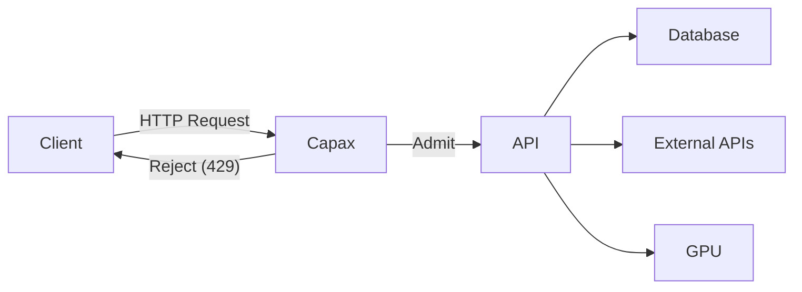

<p align="center">
  
</p>

# Capax
## Stop expensive queries **before they burn infrastructure money**
**Policy‑driven query cost admission control for HTTP APIs.**

Capax sits **in front of an API endpoint** and decides in constant time whether a request should start **right now**.

Instead of limiting *requests per minute*, Capax limits the only number that matters when systems approach saturation:

**in‑flight workload cost**.

If starting a request would exceed the safe workload budget, Capax rejects it immediately — before the database, GPU, or external API work begins.

---

# Architecture



Capax acts as a **cost‑aware gatekeeper** in front of expensive infrastructure.

It prevents queries from starting if they would push the system past its safe workload budget.

---

# Why Capax exists

Capax started from a genius (simple but tricky) engineering challenge:

> Build an API with strict concurrency control and correct status reporting.

While implementing it, one insight became obvious:

**the moment you decide to start work is the moment money is committed.**

Most systems fail **after work has already started**:

- database scans already triggered
- external APIs already called
- GPU inference already started
- retries already multiplied load

Capax moves the decision **earlier**.

---

# The retry spiral (why systems collapse)

When systems approach saturation:

1. latency increases
2. clients retry
3. retries multiply load

This creates a feedback loop:

```
traffic spike
     ↓
latency rises
     ↓
clients retry
     ↓
more in‑flight work
     ↓
system overload
```

Failing **late** wastes money.

Failing **early** protects infrastructure.

---

# Visual example: slot budgeting

Capax uses a **slot budget** representing system capacity.

Example:

```
capacity = 10 slots
```

Requests consume different slot weights.

```
cheap query = 1 slot
heavy query = 5 slots
```

Possible combinations:

```
10 cheap queries allowed
2 heavy queries allowed
1 heavy + 5 cheap allowed
```

If a request would exceed capacity:

```
current_slots + request_weight > capacity
→ reject immediately (429)
```

---

# What makes a query heavy

Heavy queries are requests that trigger expensive work:

- large database scans
- complex joins
- vendor API calls
- LLM inference
- large response payloads
- deep GraphQL queries
- expensive filters or aggregations

Capax allows you to **define this cost explicitly**.

---

# Policy‑based cost detection

Capax reads request data and maps it to cost weights.

Example policy:

```yaml
max_allowed_concurrent_capacity: 10

cost:
  field: drinkType
  values:
    beer: 1
    cocktail: 3
    champagne: 5
```

Example request:

```json
{
  "drinkType": "cocktail"
}
```

Capax assigns the request **3 workload slots**.

Admission rule:

```
admit if current_slots + request_slots <= capacity
reject otherwise
```

---

# Real API examples

## LLM APIs

```
model=gpt‑3.5 → weight 1
model=gpt‑4 → weight 6
```

Prevents GPU overload during spikes.

---

## Search APIs

```
limit=10 → weight 1
limit=1000 → weight 8
```

Prevents massive scans from monopolizing the database.

---

## GraphQL APIs

```
depth=2 → weight 1
depth=10 → weight 5
```

Prevents deep nested queries from overwhelming services.

---

# Why Capax is different

| Tool | Controls |
|-----|----------|
Rate limiters | request frequency |
Queues | backlog latency |
Autoscaling | infrastructure after overload |
Athena / Synapse | query execution |
Power BI capacity | analytics workload |

Capax controls **query admission**.

It decides whether a query should **start at all**.

---

# Policy Packs

Capax is configuration‑first.

A pack contains:

```
policy.yaml
sample_request.json
compiled_policy.json
qa_scenarios.yaml
```

Policy packs are:

- versioned
- reproducible
- portable
- auditable

---

# Built-in QA scenarios

Capax auto-generates QA scenarios from the policy.

These scenarios are designed to prove that the gate behaves correctly under both normal and adversarial conditions.

They cover:

- capacity boundary overflow

- mixed cheap/heavy workloads

- case-insensitive value matching

- missing field behavior

- unexpected values

- retry/idempotency protection

- lifecycle release timing

Capax also includes load simulation QA, which pushes the endpoint with randomized mixes of:

- known values

- case variants

- unexpected values

- more-than-expected concurrency

This makes the QA layer far more realistic than simple happy-path checks.


# Real-time QA output

When you run QA, Capax prints progress live in the CLI.

Example:
```bash
Target URL: http://127.0.0.1:8080/order

[1/7] Running scenario: cheap_request_accepts
Why: Cheapest known value should be accepted when capacity is available.
  payload: {"customerId":"cust_001","drinkType":"beer"}
  status: 200
  PASS

[2/7] Running scenario: case_variant_BEER
Why: Known values must match case-insensitively.
  payload: {"customerId":"cust_001","drinkType":"BEER"}
  status: 200
  PASS

[7/7] Running scenario: randomized_load_simulation
Why: Random load with mixed known values, case variants, and unexpected values should never break admission rules.
  simulation 1/20: status 200
  simulation 2/20: status 429
  simulation 3/20: status 400
  ...
  PASS
```

---

# Quickstart
## 1) Install
```bash
python -m venv .venv
source .venv/bin/activate
pip install -r requirements.txt
pip install -e .
```

## 2) Cli workflow

Get the list of all commands:
```
capax helper
```

Create a policy pack:
```
capax init
```

Run the server in foreground:
```
capax run --pack <pack> --lang node --framework express --host 127.0.0.1 --port 8080
```

Run the server in background:
```
capax run --pack <pack> --lang node --framework express --host 127.0.0.1 --port 8080 --background
```

Run the reference engine in background:
```
capax run --registry server/registry.yaml --host 127.0.0.1 --port 8080 --background
```

Execute QA scenarios with live progress:
```
capax qa --pack <pack> --http http://127.0.0.1:8080
```

Inspect a pack:
```
capax inspect --pack <pack>
```

Regenerate artifacts:
```
capax rerun --pack <pack> --action compile
```

Generate runtime scaffolding:
```
capax generate --pack <pack> --lang node --framework express
```


---

# Code generation

Capax generates guardrails for multiple stacks.

| Language | Framework |
|----------|-----------|
Node.js | Express / Fastify |
Python | FastAPI |
Rust | Axum |

---

# Where Capax saves real money

**AI platforms**
Prevent expensive LLM calls during spikes.

**Gambling platforms**
Stop bonus abusers from triggering costly queries repeatedly.

**Search APIs**
Prevent massive pagination queries from overwhelming databases.

**Multi‑tenant SaaS**
Prevent one tenant from consuming the whole query budget.

---

# Learn more

https://medium.com/@edouard-kombo/capax-stop-costly-queries-before-they-start-concurrency-control-framework-yaml-based-e8292ccd349b

---

## Documentation
- `docs/POLICY_LOCKS.md`
- `docs/QA_MATRIX.md`

---

**Control the cost of queries before they start.**

